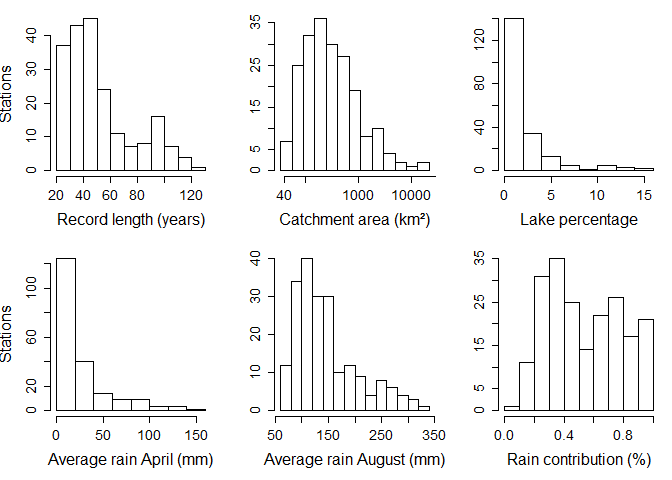
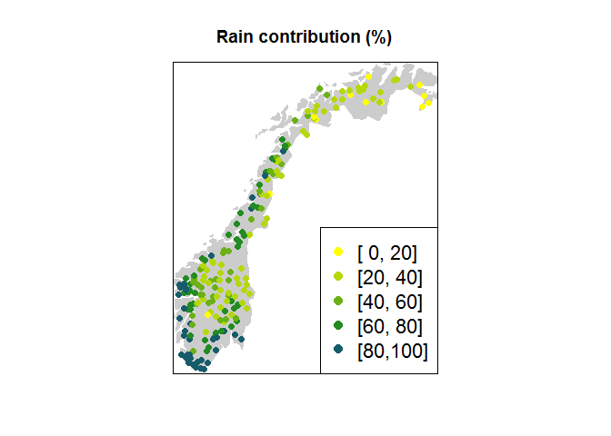
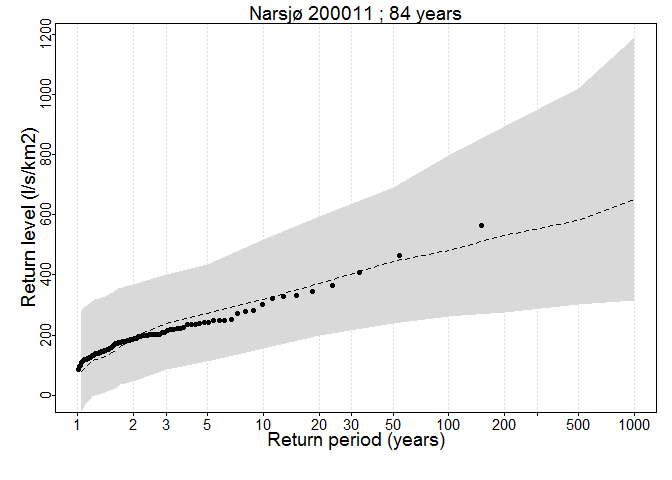
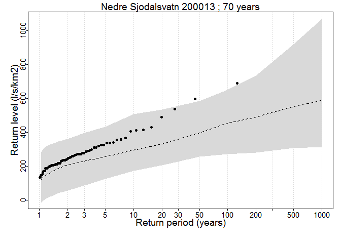

<!-- README.md is generated from README.Rmd. Please edit that file -->
Bayesian regional flood frequency analysis (FFA)
================================================

This tutorial describes the data and analysis considered for Bayesian hierachical model for Regional flood frequency analysis.

Installation
------------

First, you need to install the SpatGEVBMA package from NorskRegnesentral GitHub respository

``` r
# install.packages("devtools")
devtools::install_github("NorskRegnesentral/SpatGEVBMA")
```

Then load the data and functions used for the analysis.

``` r
# Load yearly flood time series and covariates
load('data/norwayFlood.RData')

# Load functions 
source('scripts/functions.R')
```

We start by exploring some descriptive plots of the covariates. Considering first histograms of the record length, catchment area, percentage of lake, average rain in April and August and percentage of flood contributed to rain vs. snowmelt.



Now we plot the time series of some selected stations. 

Then we plot the percentage of flood contributed to rain vs. snowmelt according to longitude and latitude of the each considered station, to reveal the spatial distribution of this covariate.



Main analysis
=============

The main analysis is carried by running 100 000 MCMC simulation by the SpatGEV package. The flood data is structured as a list of time series, one for each station, to allow for difference serie lengths. The covariates are centered and scaled before analysis.

First, the SpatGEVBMA package is loaded. We run the package with the options to to non-spationally distributed error, to have the regression model for the scale parameter on a log scale and to print an output for every 5000 MCMC run.

``` r
library(SpatGEVBMA)
nsim <- 100
res <- spatial.gev.bma(datalist,covMat,S,nsim,prior.user=prior.user,
                       nonspatial = TRUE, log.kappa=TRUE,print.every=5000)
res$cov.names <- colnames(covariates)
```

The result can be analysed by first removing a suitable range of burn-in samples, we seletion 20 000 or 20% of the total MCMC runs. The calculated the inclustion probabilities for each of the covariates within the location (*μ*), scale (log*κ*), and shape (*ξ*) parameter of the GEV distribution.

    #>                     mu kappa  xi
    #> Constant           100   100 100
    #> latitude           100   100   0
    #> pct.eff.lake        86   100   0
    #> inflow              32    78   0
    #> avg.frac.rain        9    78  26
    #> area.total           0    81   5
    #> avg.rain.april      96     0  28
    #> avg.rain.august    100   100   0
    #> avg.snowmelt.march   0    12   0
    #> gradient           100   100   0
    #> pct.bedrock        100    88   0
    #> relative.area        0   100  30

Then we plot the resulting distribution according to the quantiles or return values, e.g for 1000 year flood, we calculated the 1 − 1/1000 = 0.999 quantile. The random effects for each MCMC run are simulated from a Gaussian distribution with the corresponding variance 1/*α*<sup>(*r*)</sup>, separately for each distribution parameter.

``` r
#Plot return values plots
plotReturnLevel(return.level = return.level,floodData = floodData,
                floodCov = covariates,
                T=T,writeToFile=FALSE,ymin=-0.01,ymax=NULL)
#> [1] "200011" "200013"
```


